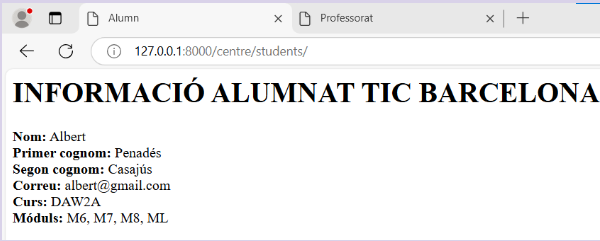
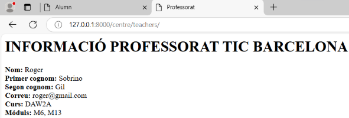
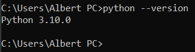

# django_albert
## Punt 1
## Punt 1.1
### Informació alumnat

### Informació professorat

## Punt 1.2 (millorat i amb header)
### Informació alumnat

### Informació professorat

### Distribució del projecte i de l'app

## Punt 2

## Punt 3

# Activitat 14
#### Inici de la pràctica 12-02-25
## Pre-activitat
#### · He cambiat la versió de python: per la 3.10.0

#### · Configuració Pycharm (interpreter per python i la nova versió).

#### · Aplicar canvis i els guardo.

#### · Resulat final:

###  · Creació de l'entorn virtual

###  · Activació de l'entorn

### ·  Instal·lació del Django (dins del nou entorn virtual)

###  · Comprobació de la versió Django sigui la correcte

###  · Instal·lació de pyscopg2 per PostgresSQL

### · La creació del  projecte (seguiment de l'anterior)
#### En aquest projecte seguiré amb el projecte creat anteriorment, el directori: TIC_BCN_APC 
Aquest seria el resultat de la distribució de l'activitat 14:

### · Creació del fitxer Docker (docker.compose.yml)

#### 

